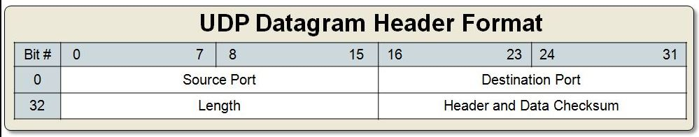
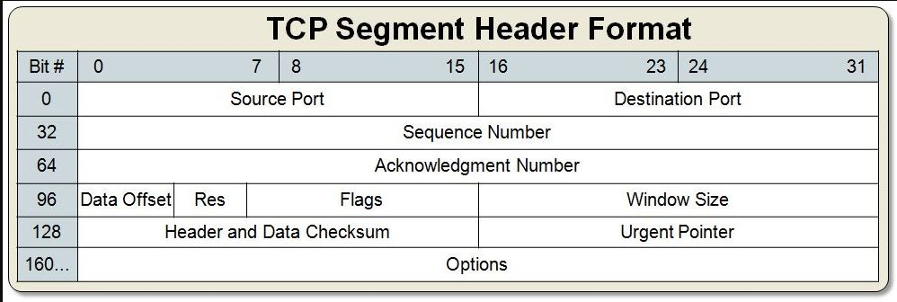
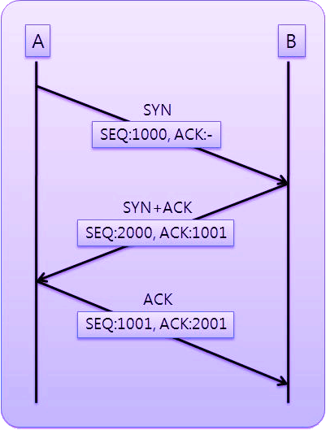
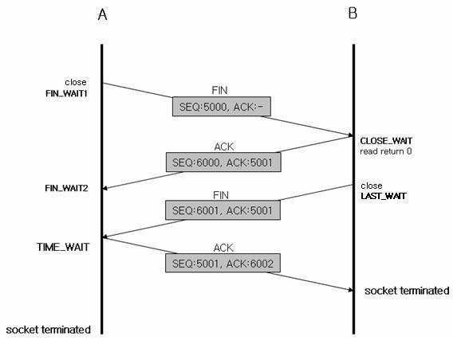
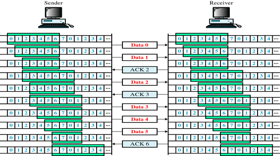

# TCP/UDP Protocol

## Port Address
- 응용 프로그램을 구분하기 위한 주소.
  - `80` : 웹용
  - `22` : ssh 연결
  - `21` : FTP 서버
  - `25` : SMTP 메일 서버
  - `53` : DNS 서버
- 하위계층(TCP, IP, Ethernet) 으로부터 수신한 데이터를 어느 응용 프로그램으로 전달할지를 결정한다.

### TCP, UDP의 비교.

|   | **TCP**  | **UDP**  |
|:-:|:-:|:-:|
| 개발 이유  | WAN의 신뢰성 문제  | TCP 대체 목적  |
| 연결성  | **연결지향**  | 비 연결지향  |
| 전송 순서  |  순서 별 전송 |  순서를 무시한 전송 |
| 신뢰성  |  **신뢰성 있는 전송** | 신뢰성 결여  |
|  예시 | 전화 통화  | 문자메세지, 영상 통화  |
| 오버 헤드  | 크다  | 작다.  |

- TCP의 **연결지향** 의 의미 :
  - 연결 지향 서비스[connection-oriented service]
  - 송신자와 수신자 사이에 먼저 연결이 설정이된 후 데이터가 전송된다.
  - 언제나 수신자와 송신자가 연결되어 있다는 뜻은 아니다.
- TCP : 웹서버, FTP서버
- UDP : 게임 서버, VoIP

## UDP Datagram Protocol

- UDP 프로토콜은 **신뢰성** 보다는 **실시간성**이 더 중요한 경우에 사용한다.
- 사용 예
  - 상위 계층의 신뢰성을 보장해 주는 경우 (TFTP)
  - 데이터가 반복적으로 전달되는 경우
  - 연결 맺는 번거로운 과정을 피해 간단히 동작해야 할때(오버헤드)(DNS)

## TCP(Transmission Control Protocol)

- **Sequence Number(순서 번호)** : 연결 맺은 후 순차적으로 증가하여 현재의 순서를 알려주는 번호
- **Acknowledgement number(확인 응답 번호)** : 상대방 노드로부터 다음 번에 수신해야 할 순서번호

- **SYN(Synchronization:동기화) - S : 연결 요청 플래그**
TCP 에서 세션을 성립할 때  가장먼저 보내는 패킷, 시퀀스 번호를 임의적으로 설정하여 세션을 연결하는 데에 사용되며 초기에 시퀀스 번호를 보내게 된다.

- **ACK(Acknowledgement) - Ack : 응답**
상대방으로부터 패킷을 받았다는 걸 알려주는 패킷, 다른 플래그와 같이 출력되는 경우도 있습니다.
받는 사람이 보낸 사람 시퀀스 번호에 TCP 계층에서 길이 또는 데이터 양을 더한 것과 같은 ACK를 보낸다.(일반적으로 +1 하여 보냄) ACK 응답을 통해 보낸 패킷에 대한 성공, 실패를 판단하여 재전송 하거나 다음 패킷을 전송한다.

- **RST(Reset) - R : 제 연결 종료**
재설정(Reset)을 하는 과정이며 양방향에서 동시에 일어나는 중단 작업이다. 비 정상적인 세션 연결 끊기에 해당한다. 이 패킷을 보내는 곳이 현재 접속하고 있는 곳과 즉시 연결을 끊고자 할 때 사용한다.

- **PSH(Push) - P : 밀어넣기**
TELNET 과 같은 상호작용이 중요한 프로토콜의 경우 빠른 응답이 중요한데, 이 때 받은 데이터를 즉시 목적지인 OSI 7 Layer 의 Application 계층으로 전송하도록 하는 FLAG. 대화형 트랙픽에 사용되는 것으로 버퍼가 채워지기를 기다리지 않고 데이터를 전달한다. 데이터는 버퍼링 없이 바로 위 계층이 아닌 7 계층의 응용프로그램으로 바로 전달한다.

- **URG(Urgent) - U : 긴급 데이터**
Urgent pointer 유효한 것인지를 나타낸다. Urgent pointer란 전송하는 데이터 중에서 긴급히 전당해야 할 내용이 있을 경우에 사용한다. 긴급한 데이터는 다른 데이터에 비해 우선순위가 높아야 한다.
  - EX) ping 명령어 실행 도중 Ctrl+c 입력

- **FIN(Finish) - F : 연결 종료 요청**
세션 연결을 종료시킬 때 사용되며 더이상 전송할 데이터가 없음을 나타낸다.

#### TCP 3-way handshake(Connection Establish)
- 다음은 TCP프로토콜이 연결될때의 흐름을 나타내는 그림이다.

  - 클라이언트가 연결을 요청하는 segment를 보낸다. **SYN** flag가 set되어서 날라간다.
  - 서버는 **SYN, ACK** flag가 set되어서 응답한다. 이때, 서버는 자신이 보낼 메세지는 2000번 세그먼트를 보내고, 클라이언트에게 다음 세그먼트번호인 1001번을 요청한다.
  - 클라이언트는 응답을 받은 후, 서버가 요청한대로 1001번 세그먼트를 보내고, 서버측에 보낸 2000번 세그먼트의 다음 번호인 2001번 세그먼트를 요청한다.

#### TCP 4-way handshake(Connection Closed)

#### Flow Control(윈도우 관리)

- 슬라이딩 윈도우.
- **Window(=Buffer=Queue)**
- TCP 슬라이딩 윈도우 기법은 수신 측에서 설정한 윈도우 크기만큼 송신 측에서 확인 응답 없이 세그먼트를 전송할 수 있게 하여 데이터 흐름을 동적으로 조절하는 제어 기법이다. 이처럼 슬라이딩 윈도우 기법을 통하여 송신 버퍼의 범위는 수신 측의 여유 버퍼 공간을 반영하여 동적으로 바뀜으로써 흐름제어를 수행하게 된다.

- 슬라이딩 윈도우는 일단 윈도우에 포함되는 모든 패킷을 전송하고, 그 패킷들의 전달이 확인 되는대로 이 윈도우를 옆으로 옮김(Slide)으로서 그 다음 패킷들을 전송하는 방식이다.

- 또한 윈도우의 크기만큼은 수신 쪽의 확인(응답)을 받지 않고도 보내는 것이 가능하므로 매번 전송한 패킷에 대해 확인을 받아야만 그 다음 패킷을 전송하는 방법(stop-and-wait)를 사용하는 것보다 훨씬 네트워크를 효율적으로 사용할 수 있다.
