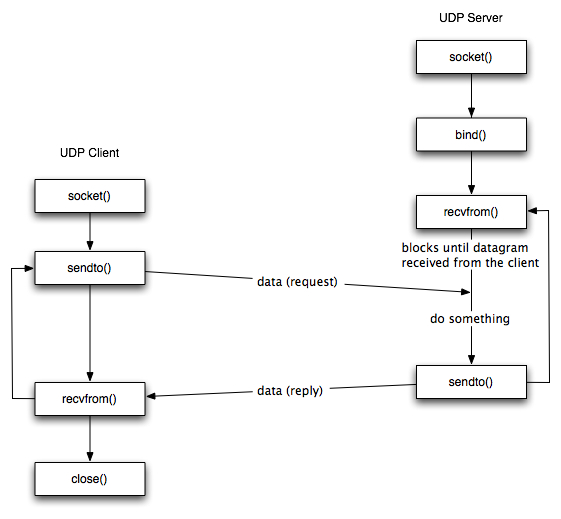

# Socket
- 네트워크로 연결된 컴퓨터의 통신 접점에 위치한 통신 객체(추상적 개념)

- **Stream Socket(TCP)**
- **Datagram Socket(UDP)**

- **Socket = IP Address + Port Address**
- **IPC의 일종이다!!**
- 응용 프로그램은 소켓이 제공하는 기능을 사용하기만 하면 된다.

#### Stream(TCP)

- 서버측
  - `socket()`
  - `bind()`
  - `listen()`
  - `accept()` : 서버가 클라이언트의 연결 요청을 기다림. / `blocking` 함수
  - `read()`
  - `write()`
  - `close()`

- 클라이언트 측
  - `socket()`
  - `connect()` : `blocking` 함수
  - `write()`
  - `read()`
  - `close()`

- `socket()`
- `bind()`
- `sendto()`
- `recvfrom()`
- `close()`
